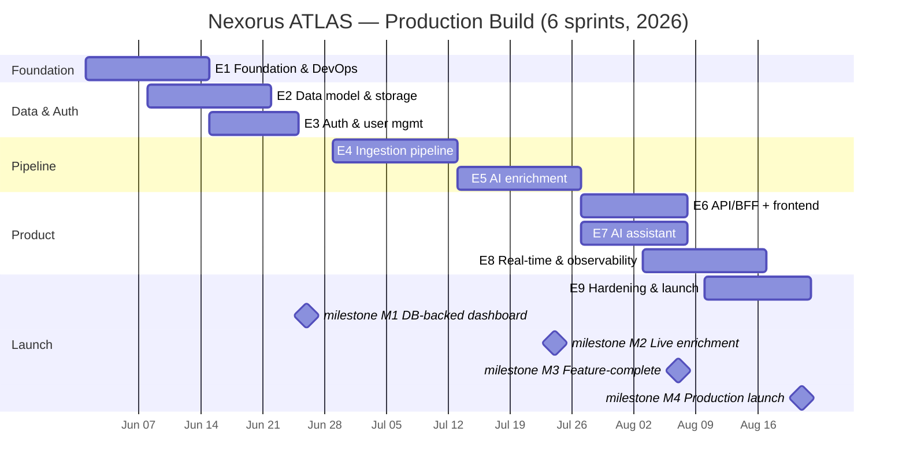

# Nexorus ATLAS — Production Architecture, WBS & Sprint Plan

**Status:** Draft for review · **Date:** 2026-05-25 · **Author role:** Senior Software Architect
**Scope:** Turn the static `atlas-static` prototype into a production-ready, backed system —
**login page + all dashboard features**. Everything under the **Settings** menu is explicitly **out of scope**.

---

## 1. Context & current-state assessment

`atlas-static` is today a **beautiful static prototype** of the *MBG Crisis Dashboard* ("Nexorus ATLAS"):

- **Stack:** Next.js 16 (App Router) · React 19 · TypeScript · Tailwind v4 · Leaflet · react-grid-layout · `@anthropic-ai/sdk`. Deployed on Vercel.
- **Auth (demo-grade):** hardcoded credentials in client code (`app/login/page.tsx`), an `atlas_auth=1` *presence* cookie, and a redirect-only `middleware.ts`. Not real security.
- **Data (static):** the entire dashboard renders from one bundled `mbg-crisis-data-v2.json` (~37 KB). `lib/mbg/data.ts#buildDashboard()` **rebases all timestamps to "now"** so frozen data *looks* live. The only genuinely live call is USD/IDR (`lib/market/usdidr.ts`). Map uses `public/geo/idn-provinces.geojson` (~343 KB).
- **Features:** Crisis Index gauge, Insight, Prediction meters, Indonesia incident map, Top cities, Articles feed + AI detail modal, Social actor ("Homeless Media") analysis, Leadership sentiment, live ticker, draggable widget layout (persisted in `localStorage`), War Room mode, and the **Nexorus AI layer** (copilot chat, briefing/SITREP, per-widget Ask, forecast) — hybrid scripted-fallback / live-Anthropic in `lib/ai/*` and `app/api/v1/ai/*`.

**Gap to production:** no real auth/users, no real data source (static JSON with faked freshness), no history/trends (a single frozen moment), no persistence (layout in `localStorage`), single LLM vendor, no ingestion pipeline, no observability/DR.

This document specifies the production system that fills those gaps.

---

## 2. Decisions (from stakeholder Q&A)

| # | Decision | Choice |
|---|---|---|
| D1 | Tenancy | **Internal single-org tool** — one workspace, role-based users, no tenant isolation |
| D2 | Data source | **Hybrid** — 3rd-party feeds (Indonesian RSS + news APIs + X/IG/Facebook/TikTok) enriched by a **model-agnostic** LLM layer (Claude / Gemini / GPT) |
| D3 | Cloud / infra | **DigitalOcean** — App Platform, Managed Postgres, Managed Redis (Valkey), Spaces (S3), Container Registry |
| D4 | Team / timeline | **2–3 devs, ~3 months** → 6 × two-week sprints |
| D5 | Backend topology | **Topology C as a monorepo** — Next.js (UI + BFF) + Python (ingestion + all LLM work); Postgres is the contract |
| D6 | Library choices | Architect's discretion (see §5) |
| D7 | Assistant placement | **Python owns 100% of LLM** (batch enrichment *and* interactive assistant); Next BFF is a thin streaming proxy |
| D8 | Auth method | **Email/password only** (no SSO in this phase) |

---

## 3. Goals & non-goals

**Goals**
- Real authentication (email/password), server-side sessions, RBAC (admin / analyst / viewer), audit log.
- A real **data pipeline**: ingest Indonesian RSS + news APIs + social (X/IG/FB/TikTok), store raw + normalized, enrich with a model-agnostic LLM layer.
- **Real persistence & history**: Postgres as source of truth; time-series crisis snapshots → genuine trends (no more faked timestamps).
- Every existing dashboard widget wired to **live data**; per-user layout persisted server-side.
- The Nexorus AI assistant productized on **real, grounded data**, model-agnostic, cost-tracked.
- Production operations: CI/CD, observability, backups/DR, security hardening, runbooks.

**Non-goals (this phase)**
- Anything under the **Settings** menu.
- Multi-tenancy / billing (single-org only; revisit later).
- SSO / MFA (email/password only; MFA noted as future).
- Building/training custom ML models (LLM-via-API only).
- Native mobile apps.

---

## 4. Architecture overview (topology C, monorepo)

**Principle:** Python owns all LLM/NLP work (batch + interactive); the Next.js BFF owns auth + reads; **Postgres is the contract** between them. Python writes enriched rows, the BFF reads them.

```
┌──────────────────────────── MONOREPO (one git repo) ─────────────────────────────┐
│ apps/web            Next.js 16  →  UI + BFF /api/v1/*                              │
│                       • Auth.js (email/password, sessions, RBAC)                   │
│                       • Dashboard read APIs  (reads Postgres via Kysely)           │
│                       • SSE proxy for live ticker / new-incident alerts            │
│                       • Thin streaming proxy → AI service                          │
│                                                                                    │
│ services/pipeline   Python  →  FastAPI "ai-api" + Celery workers                   │
│                       • ai-api: chat / briefing / forecast / widget-ask (LiteLLM)  │
│                       • beat:   schedules crawls (cron)                            │
│                       • worker: ingest connectors → enrich (LiteLLM) → write DB    │
│                                                                                    │
│ packages/contracts  OpenAPI (from FastAPI) → generated TS types; shared enums      │
│ infra/              Terraform (DO) + Dockerfiles + docker-compose (local)          │
└───────────┬───────────────────────────┬────────────────────────────┬─────────────┘
            │                            │                            │
     Managed Postgres              Managed Redis                  Spaces (S3)
   structured + time-series     Celery broker + cache +      raw HTML, avatars,
   (single source of truth)     rate-limit + pub/sub         geojson, PDF exports
            ▲                                                        ▲
            └── External: Indonesian RSS + news APIs · X/IG/FB/TikTok (API/aggregator) ──┘
                          · LLM providers (Claude/Gemini/GPT) · USD-IDR feed
```

**End-to-end data flow**

1. **Beat** fires a per-source crawl on schedule.
2. **Worker (ingest)** pulls the feed via the matching **connector**, writes a raw snapshot to **Spaces**, and upserts a normalized `articles`/`actor_posts` row to **Postgres** (deduplicated).
3. **Worker (enrich)** calls **LiteLLM** (model-agnostic) for crisis score, geocode/NER, sentiment, summary, keywords, predictions → writes `article_enrichment` and rolls up `crisis_snapshots`, `city_metrics`, etc.
4. **BFF** reads aggregated rows (Kysely) and serves the dashboard; **ai-api** answers assistant requests grounded on the same DB.
5. **NOTIFY → SSE** pushes ticker/alert updates to the browser; TanStack Query is the polling baseline.

**Migration of existing AI code:** `lib/ai/{engine,context,scripted}.ts` and `app/api/v1/ai/*` move into the Python **ai-api**. The Next AI routes become a streaming proxy with a minimal scripted fallback retained for resilience if ai-api is unreachable.

**Schema ownership (critical for a polyglot repo):** **Alembic (Python) is the single source of schema truth.** The TS side never migrates — it runs `kysely-codegen` against the live DB to generate types. This eliminates dual-ORM conflicts.

---

## 5. Repository structure & tooling

```
atlas/                          # monorepo root
├── apps/
│   └── web/                    # Next.js 16 (UI + BFF) — existing app migrates here
├── services/
│   └── pipeline/               # Python: ai-api (FastAPI) + Celery worker + beat + connectors
│       ├── ai_api/             #   FastAPI app (assistant endpoints)
│       ├── ingest/             #   connector abstraction + per-source connectors
│       ├── enrich/             #   LiteLLM tasks (score/geo/sentiment/summary/keywords/predict)
│       ├── db/                 #   SQLAlchemy models + Alembic migrations (SOURCE OF TRUTH)
│       └── worker.py / beat.py
├── packages/
│   └── contracts/              # OpenAPI (from FastAPI) → openapi-typescript; shared enums/consts
├── infra/
│   ├── terraform/              # DO: Postgres, Redis, Spaces, DOCR, App Platform spec
│   └── docker/                 # Dockerfiles + docker-compose.yml (local: pg, redis, web, ai-api, worker, beat)
├── .github/workflows/          # CI: lint/test/build/typegen → push DOCR → deploy
├── Taskfile.yml                # cross-language task runner (dev, test, migrate, typegen, up)
├── turbo.json                  # JS task graph + cache
├── pnpm-workspace.yaml
└── pyproject.toml + uv.lock    # Python deps via uv
```

**Tooling:** pnpm workspaces + **Turborepo** (JS), **uv** (Python), root **Taskfile** + **docker-compose** for local orchestration. (Nx considered and rejected — heavier than a 2–3 dev team needs for two apps.)

### Recommended stack

| Concern | Choice | Rationale |
|---|---|---|
| Python API | **FastAPI + Pydantic v2 + uvicorn** | Async, typed, auto-OpenAPI feeds TS types |
| Jobs / scheduler | **Celery + Celery Beat** on Redis | Mature crawl/enrich queue; reuses Redis |
| LLM abstraction | **LiteLLM** (+ **instructor** for typed outputs) | One API over Claude/Gemini/GPT with retries, fallback, **cost tracking** |
| Ingestion | **httpx**, **feedparser**, **trafilatura** | Async fetch · RSS · robust article-body extraction |
| Python DB | **SQLAlchemy 2.0 + Alembic** | Owns schema + migrations (source of truth) |
| TS DB read | **Kysely + kysely-codegen** | Type-safe SQL from an externally-owned schema |
| Auth | **Auth.js v5** (Credentials provider, DB sessions, `@auth/kysely-adapter`), **Argon2** hashing | Single-org RBAC: admin / analyst / viewer |
| API validation | **Zod** (BFF) · Pydantic (Python) | |
| Client data | **TanStack Query** | Replaces manual `fetch`/`setInterval`; caching, refetch, error states |
| Charts | **Recharts** | New historical/trend views (existing SVG gauges stay) |
| Realtime | Postgres **LISTEN/NOTIFY → SSE** | Live ticker + alerts without a WS server |
| Observability | **Sentry** + OpenTelemetry + DO metrics + **Better Stack** logs | Errors, traces, logs |
| Deploy | **DO App Platform** components + **DOCR** + GitHub Actions; **Terraform** for managed resources | Matches DO choice |

---

## 6. Component designs

### 6.1 Web (`apps/web`) — Next.js BFF + UI
- **Auth:** Auth.js v5 Credentials provider; Argon2 password verification; DB-backed sessions (httpOnly, SameSite=Lax, rotation). `middleware.ts` upgraded from presence-cookie to real session + role checks.
- **Read APIs** (`/api/v1/*`): `GET /mbg-crisis` (now reads Postgres, not static JSON), `GET /article-detail`, `GET /trends`, layout CRUD, `GET /sse` (ticker/alerts). All inputs Zod-validated; reads via Kysely; 30–60 s Redis cache on the dashboard payload.
- **AI proxy:** `/api/v1/ai/{chat,briefing,forecast,widget}` authenticate + rate-limit, then **stream-proxy** to Python ai-api; tiny scripted fallback if ai-api is down.
- **UI changes:** wire every widget to live data via TanStack Query; move layout persistence from `localStorage` → `dashboard_layouts` table; add loading/empty/error states; add Recharts trend views fed by `crisis_snapshots`.

### 6.2 AI service (`services/pipeline/ai_api`) — FastAPI
- Endpoints mirror today's assistant: streaming `chat`, `briefing` (SITREP), `forecast`, `widget` ask.
- Grounding context built from **Postgres** (replaces `lib/ai/context.ts` reading static JSON).
- **LiteLLM** routes to the configured provider with fallback chain; **instructor** enforces Pydantic-typed outputs; per-call cost/token logging to `ai_messages`.

### 6.3 Workers (`services/pipeline`) — Celery
- **Beat** schedules per-source crawls (cadence per `sources` row, default 30 min).
- **Ingest tasks:** connector → raw to Spaces → normalized upsert (dedup) to Postgres.
- **Enrich tasks:** fan-out per new article/post → LiteLLM enrichment → write `article_enrichment`; periodic rollup task computes `crisis_snapshots`, `city_metrics`, `keywords`, `predictions`, `insights`, actor/leader aggregates.

### 6.4 Contracts (`packages/contracts`)
- FastAPI → OpenAPI JSON → **openapi-typescript** → TS client types for the AI proxy.
- `kysely-codegen` → TS DB types from the live schema.
- Shared enums/constants (crisis levels, issue taxonomy, platforms, risk levels) defined once.

---

## 7. Data ingestion design

### 7.1 Connector abstraction
A single `SourceConnector` interface (`fetch() -> list[RawItem]`) with implementations per source type, registered against `sources` rows. This isolates the messy, ToS-sensitive platform specifics behind one contract and lets each platform be official-API **or** aggregator-backed without touching the pipeline.

### 7.2 Sources in scope
- **Indonesian RSS** (open, cheapest, highest-volume): Detik, Kompas, CNN Indonesia, Tribun, Antara, Tempo, Liputan6, Republika, Suara, CNBC Indonesia, etc. — via `feedparser` + `trafilatura` for full-text.
- **News APIs** (language=`id`, country=`id`): NewsData.io, GNews, NewsAPI, MediaStack — connectors are pluggable; pick based on Indonesian coverage + budget during S3.
- **Social — X / Instagram / Facebook / TikTok** (see risk R1): each via either official API or a paid aggregator connector.

### 7.3 ⚠️ Social platform reality (Risk R1 — top project risk)
Monitoring **arbitrary third-party accounts** is the hard part, not a code problem:
- **X (Twitter):** API v2 is paid and rate-limited; Basic/Pro tiers required for meaningful search/timeline access.
- **Meta (Facebook / Instagram):** Graph API only exposes **owned/business** Pages/IG accounts (+ limited public IG via Business Discovery). General monitoring of others' accounts is **not** supported by the official API.
- **TikTok:** Research API is gated/approval-based; commercial monitoring typically needs a third-party provider.
- **Practical path:** use **paid aggregators** (Apify, Bright Data, Ensembledata, or a social-listening vendor) behind the connector interface for the platforms official APIs can't cover. **Implications: recurring cost, ToS/legal review, and reliability risk.** Decide per-platform in S3; default to RSS + news APIs first (full value, low risk), add social incrementally.

### 7.4 Normalization, dedup, storage
- Normalize to a common `RawItem` → `articles` / `actor_posts`.
- **Dedup** by canonical URL + content hash (SimHash/MinHash for near-dup); upsert.
- Raw HTML/JSON snapshot → **Spaces** (provenance/audit); pointer stored as `raw_uri`.
- Per-source rate limiting + backoff via Redis; failures logged, retried with Celery.
- **Initial backfill (light):** on a source's first crawl, pull the recent window it naturally exposes (RSS full feed; news-API items ≤~30 days, capped), then switch to incremental — **no paid deep-archive access**. Snapshots are retro-computed over this window so trends aren't empty at launch (feature W5).

---

## 8. AI enrichment & assistant design

- **Model-agnostic** via LiteLLM; provider/model selectable per task (e.g., cheap model for scoring, stronger for summaries) with a fallback chain across Claude/Gemini/GPT.
- **Enrichment tasks → typed outputs** (instructor + Pydantic): crisis score (0–10) + level, dominant/secondary issues, geocode (city/province/lat/lng) via LLM NER + an Indonesia gazetteer reconcile, sentiment, summary/`ai_reasoning`, keywords (+ sentiment), per-article forecast, dashboard-level predictions/insights.
- **Cost governance:** every call logs model/tokens/cost; per-day budget guardrail; prompt-cache stable grounding context (the existing engine already caches the system block).
- **Assistant:** chat (stream), briefing/SITREP, forecast, widget-ask — grounded on Postgres; scripted deterministic fallback retained for zero-cost/offline resilience.

---

## 9. Data storage design (the core "where do we store data" question)

**Three stores, each for what it does best.**

### 9.1 Managed Postgres — source of truth (structured + time-series)
PostGIS optional (city points are simple lat/lng; plain columns suffice initially).

```sql
-- Identity & access
users(id, email UNIQUE, password_hash, role, status, created_at, last_login_at)
sessions(id, user_id, expires_at, ...)            -- Auth.js kysely adapter
audit_log(id, user_id, action, target, meta_jsonb, created_at)

-- Sources & raw content
sources(id, name, type, platform, endpoint, cadence_sec, enabled, last_run_at, config_jsonb)
articles(id, source_id, url UNIQUE, canonical_url, content_hash, title, body, published_at,
         fetched_at, raw_uri, fts tsvector)        -- FTS index on (title, body)
article_enrichment(article_id PK→articles, score, level, dominant_issue, secondary_issues jsonb,
         ai_reasoning, city, province, lat, lng, sentiment, model, tokens, cost, enriched_at)

-- Aggregates / dashboard surfaces
crisis_snapshots(id, captured_at, score, level, article_count, high_crisis_count,
         mapped_count, unmapped_count)             -- TIME-SERIES → real trends
cities(city_key PK, city, province, lat, lng)
city_metrics(city_key, captured_at, heat, severity_sum, article_count, dominant_issue)
keywords(id, captured_at, term, count, sentiment)
predictions(id, captured_at, question, probability, answer_label, reasoning, timeframe, tone)
insights(id, captured_at, title, text, action)
market_ticker(id, captured_at, label, value, delta)

-- Social & leadership
social_actors(id, handle, name, platform, status, followers, influence, credibility, sentiment,
         risk_level, themes jsonb, brand_summary, ... , updated_at)
actor_posts(id, actor_id, text, likes, comments, views, posted_at, raw_uri)
leaders(id, name, position, organization, photo_uri)
leader_sentiment(id, leader_id, captured_at, score, trend, article_count, insight,
         prediction_jsonb)
leader_articles(id, leader_id, title, source, published_at, sentiment, crisis_score)

-- Assistant & UX state
ai_conversations(id, user_id, created_at)
ai_messages(id, conversation_id, role, content, model, tokens, cost, created_at)
dashboard_layouts(user_id PK, layout_jsonb, updated_at)   -- moves out of localStorage
```

### 9.2 Spaces (S3-compatible) — blobs
Raw article HTML/JSON snapshots (provenance), social/leader avatars (today in `public/`), the GeoJSON, generated briefing/SITREP PDF exports. Access via boto3 (Python) / AWS SDK (TS), private buckets + signed URLs.

### 9.3 Redis (Valkey) — ephemeral
Celery broker/results, dashboard-payload cache (30–60 s TTL), rate-limit counters, SSE pub/sub fan-out.

### 9.4 Key upgrades over today
- **Real history:** `crisis_snapshots` + `*_metrics` replace today's single frozen moment → genuine trend charts. **Timestamps stop being faked.**
- **Provenance:** every article traceable to a raw snapshot.
- **Server-side layouts:** per-user, multi-device.
- **Cost ledger:** every LLM call accounted for.
- **Seed/migration:** `mbg-crisis-data-v2.json` becomes the seed fixture that shapes the schema and powers local/demo runs.
- **Retention:** raw HTML ~90 d in Spaces; high-resolution metrics downsampled after ~1 y.

---

## 10. Auth & security

- **Email/password** only: Argon2id hashing, server-side sessions (httpOnly, SameSite, secure, rotation/expiry), Auth.js Credentials + Kysely adapter.
- **RBAC:** admin (manage users/sources), analyst (full dashboard + assistant), viewer (read-only). Enforced in `middleware.ts` + per-route guards.
- **Admin user provisioning** only (public registration stays disabled, matching current copy). Settings UI out of scope → seed/CLI for the first admin.
- **Hardening:** Zod/Pydantic validation everywhere, rate limiting (Redis), CSRF protection, security headers/CSP, secrets only in DO encrypted env (LLM keys live solely in the Python service), audit log on sensitive actions, dependency scanning in CI.

---

## 11. Real-time & observability

- **Real-time:** TanStack Query polling baseline; Postgres `NOTIFY` on new snapshot/high-crisis incident → BFF `/api/v1/sse` → browser updates ticker + raises alerts (powers War Room).
- **Observability:** Sentry (web + Python errors), OpenTelemetry traces across BFF→ai-api→workers, DO metrics for infra, Better Stack/Logtail for structured logs, health checks per component, pipeline freshness alert (no successful crawl in N minutes).

---

## 12. Infrastructure & deployment (DigitalOcean)

- **App Platform components:** `web` (Next.js), `ai-api` (FastAPI), `worker` (Celery), `beat` (Celery Beat). Worker+beat may share a small instance initially.
- **Managed resources (Terraform):** Postgres (daily backup + PITR), Redis/Valkey, Spaces bucket(s), DOCR.
- **CI/CD (GitHub Actions):** lint + typecheck + test (web & python) → `kysely-codegen` + OpenAPI type drift check → build & push images to DOCR → deploy App Platform. Migrations (`alembic upgrade head`) run as a pre-deploy release step.
- **Environments:** local (docker-compose) → staging → production. Promotion via tagged deploys.
- **Indicative monthly cost:** DO infra ~$70–150 (App Platform components + Postgres + Redis + Spaces + DOCR); **LLM + social-aggregator costs are variable and potentially the largest line** — budget and monitor from S4.

---

## 13. Non-functional requirements

- **Performance:** cached dashboard read < 300 ms p95; assistant first-token < 2 s.
- **Availability:** single-org internal target ~99.5%; graceful degradation (scripted AI fallback, cached payload, offline badge already exists).
- **Freshness:** default 30-min crawl cadence (configurable per source).
- **Security:** OWASP ASVS L1 baseline; secrets never client-side.
- **Maintainability:** typed end-to-end (TS + Python), generated contracts, one schema source of truth.

---

## 14. Risk register

| ID | Risk | Sev | Mitigation |
|---|---|---|---|
| **R1** | Social APIs (X/IG/FB/TikTok) can't monitor arbitrary accounts cheaply/legally | **High** | Connector abstraction; RSS+news first (full value, low risk); paid aggregators per-platform with ToS/legal review + cost cap; social is incremental, not blocking |
| R2 | LLM enrichment cost scales with article volume | Med | Cheap model for scoring, strong for summaries; batch; daily budget guardrail; cost ledger |
| R3 | Geocoding accuracy for Indonesian locales | Med | LLM NER + gazetteer reconcile; `unmapped_count` already surfaced in UI |
| R4 | Scraping/ToS legal exposure | Med | Prefer official APIs/RSS; legal review before aggregator use; respect robots/ToS |
| R5 | Polyglot monorepo friction (TS+Python) | Low | Clear boundaries, generated contracts, Taskfile, docker-compose parity |
| R6 | Scope creep into Settings/multi-tenant | Med | Explicit non-goals; defer to future phase |
| R7 | 3-month timeline with 2–3 devs | Med | Social ingestion incremental; RSS+news+AI is the MVP spine; cut social platforms first if behind |

---

## 15. Work Breakdown Structure (WBS)

- **E1 Foundation & DevOps** — monorepo scaffold (pnpm/turbo/uv/Taskfile); migrate existing Next app into `apps/web`; docker-compose (pg/redis/web/ai-api/worker/beat); Terraform DO (Postgres/Redis/Spaces/DOCR); CI/CD skeleton; Sentry/logging skeleton; env/secret management.
- **E2 Data Model & Storage** — SQLAlchemy models + Alembic schema v1; seed migration from `mbg-crisis-data-v2.json`; `kysely-codegen` wiring; Spaces buckets + access; repository/read layer.
- **E3 Auth & User Management** — Auth.js Credentials + Kysely adapter; Argon2; sessions; RBAC + middleware/guards; admin provisioning (seed/CLI); audit log.
- **E4 Ingestion Pipeline** — Celery + Beat; `SourceConnector` interface; RSS + news-API connectors; dedup + normalization; raw→Spaces; `sources` registry + scheduling; per-source rate limit/backoff. (Social connectors begin here, continue as capacity allows.)
- **E5 AI Enrichment Pipeline** — LiteLLM provider abstraction (Claude/Gemini/GPT) + instructor; enrichment tasks (score/geo/sentiment/summary/keywords/predict); rollup task → snapshots/metrics/insights; backfill; cost ledger + budget guardrail.
- **E6 API/BFF & Frontend Integration** — read APIs from Postgres (replace static `buildDashboard`); Zod validation; Redis cache; wire all widgets via TanStack Query; loading/empty/error states; layout persistence to DB; Recharts trend views.
- **E7 AI Assistant Productization** — port `lib/ai/*` + `app/api/v1/ai/*` to Python ai-api; grounding from Postgres; streaming proxy + scripted fallback; chat/briefing/forecast/widget on live data; conversation history.
- **E8 Real-time & Observability** — NOTIFY→SSE ticker/alerts; OpenTelemetry traces; dashboards; pipeline-freshness + error alerting; health checks.
- **E9 Hardening, Security & Launch** — security review (authz, rate limits, headers/CSP, deps); load/perf test; backups/DR + restore runbook; accessibility/responsive polish; docs/runbooks; UAT; production cutover.

---

## 16. Sprint plan (6 × 2-week sprints)

**Calendar:** S1 Jun 1–12 · S2 Jun 15–26 · S3 Jun 29–Jul 10 · S4 Jul 13–24 · S5 Jul 27–Aug 7 · S6 Aug 10–21, 2026.
**Roles:** Dev A = Frontend/BFF/Auth · Dev B = Python pipeline/AI · Dev C = DevOps/data (floats).

### Sprint 1 — Foundation (E1, start E2)
- Monorepo scaffold; migrate existing Next app into `apps/web`; docker-compose; Terraform DO resources; CI/CD skeleton; observability skeleton; Alembic schema v0 + `kysely-codegen` proof.
- **Acceptance:** `task up` runs web + ai-api stub + pg + redis locally; CI green; staging infra provisioned via Terraform; web deploys to App Platform.

### Sprint 2 — Auth + Data model (E3, E2) · **Milestone M1**
- Auth.js email/password, sessions, RBAC, middleware; admin seed; audit log. Full schema v1 + seed migration from static JSON; repository/read layer; `GET /mbg-crisis` reads Postgres.
- **Acceptance (M1):** real login works; unauth → /login; dashboard renders from **Postgres** (not static JSON); roles enforced.

### Sprint 3 — Ingestion pipeline (E4)
- Celery + Beat; `SourceConnector`; **RSS + news-API** connectors live; dedup/normalize; raw→Spaces; `sources` registry + scheduling; **initial light backfill** (recent window + retro-snapshots, W5). Begin social connector spike (X or aggregator PoC) — time-boxed.
- **Acceptance:** scheduled crawl ingests real Indonesian articles into Postgres + raw to Spaces; dedup verified; sources configurable.

### Sprint 4 — AI enrichment (E5) · **Milestone M2**
- LiteLLM abstraction + instructor; enrichment tasks; rollup → `crisis_snapshots`/`city_metrics`/keywords/predictions/insights; backfill; cost ledger + budget guard.
- **Acceptance (M2):** newly ingested articles auto-enriched (score/geo/sentiment/summary); dashboard reflects **live, enriched** data; LLM cost tracked per call; provider switch (Claude↔Gemini↔GPT) works via config.

### Sprint 5 — Assistant + real-time + frontend integration (E6, E7, start E8) · **Milestone M3**
- Port assistant to Python ai-api (chat/briefing/forecast/widget) + Next streaming proxy + fallback; grounding from DB; conversation history. Wire all widgets via TanStack Query; layout persistence to DB; NOTIFY→SSE ticker/alerts; Recharts trends; loading/empty/error states.
- **Acceptance (M3):** every widget on live data; assistant answers grounded on real DB, model-agnostic; layout persists server-side; ticker/alerts update in real time. **Feature-complete.**

### Sprint 6 — Hardening & launch (E9, finish E8) · **Milestone M4**
- Security review; rate limiting; headers/CSP; dep scan; load/perf test; backups/DR + restore runbook; alerting/dashboards; a11y/responsive polish; docs/runbooks; UAT; **production cutover**.
- **Acceptance (M4):** security checklist passed; backups verified by a test restore; perf targets met; runbooks complete; **production launch**.

### Gantt (Mermaid)


---

## 17. Definition of done (launch)

Real email/password auth + RBAC · all widgets on live Postgres-backed data · ingestion of Indonesian RSS + news APIs running on schedule (social per R1) · model-agnostic LLM enrichment with cost tracking · assistant grounded on real data · real-time ticker/alerts · per-user persisted layouts · backups verified via test restore · monitoring + alerting live · runbooks written · UAT signed off.

---

## 18. Open questions / future phases

- **Per-platform social decision** (official API vs which aggregator) — resolve in S3 with budget + legal input.
- **Specific Indonesian news API** — choose in S3 by coverage/budget.
- **Future phases (out of scope now):** Settings menu, multi-tenancy/billing, SSO/MFA, vector search/RAG over the article corpus, custom ML models, mobile.
